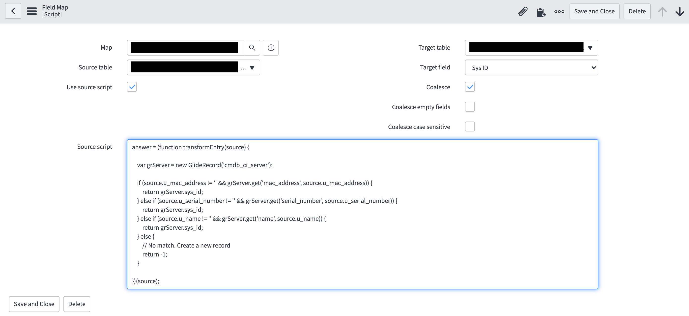

**Conditional Coalesce on Trasnform Maps**

When you have more than one field you want to coalesce based on some conditions, you can create a field mapping where source is a script and target field is SYS_ID.
You can put your conditional logic in the source script to do a conditional coalesce. Return the sys_id of the matched record for the transform to update it. Return -1 when there is not a match and you want to create a new record.

**Example configuration**

