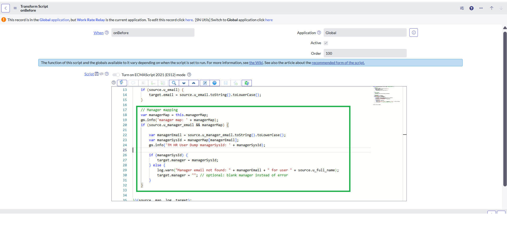

# Global Manager Map in Transform Script

## Overview

This snippet demonstrates how to build and reuse a **global lookup map** across Transform Map scripts in ServiceNow — specifically, mapping **Manager Email → sys_id** from the `sys_user` table.

By defining the map using `this.managerMap` in an **onStart Transform Script**, the data becomes available to **onBefore** or **onAfter** scripts during the same import execution, eliminating repetitive queries and improving performance.

> **DISCLAIMER**  
> This script was developed and tested on a **ServiceNow Personal Developer Instance (PDI)**.  
> It is intended for **educational and demonstration purposes only**.  
> Please **test thoroughly in a non-production environment** before deploying to production.

---

## What it does

- Preloads a dictionary of all system users (`sys_user` table) into memory.
- Maps user **email addresses** (lowercased) to their corresponding **sys_ids**.
- Shares the map globally across transform script stages (onStart → onBefore → onAfter).
- Eliminates the need for repeated `GlideRecord` queries in each transform stage on each row.
- Significantly improves transform performance when importing large data sets.

---

## Prerequisites & Dependencies

Before using this snippet, ensure that:

1. **Transform Map Context**

   - The script must be placed in a **Transform Map > Script** (e.g., “onStart” or “Run Script”).
   - Other transform scripts in the same map (e.g., onBefore or transformRow) can then reference `this.managerMap`.

2. **sys_user Table Access**

   - The transform user must have permission to **read** the `sys_user` table.

3. **Valid Email Data**
   - Ensure the `sys_user.email` field is populated and unique for all users who may appear as managers.

---

## Script Details

- **Author:** Anasuya Rampalli ([anurampalli](https://github.com/anurampalli))
- **Version:** 1.0
- **Date:** 2025-10-10
- **Context:** Transform Map → Run Script (onStart)
- **Tested On:** ServiceNow Personal Developer Instance (PDI)

---

## Example Scripts

### onBefore Script — Use Global Variable

```javascript
(function runTransformScript(source, map, log, target /*undefined onStart*/ ) {

    // Name split
    if (source.u_full_name) {
        var parts = source.u_full_name.trim().split(/\s+/);
        target.first_name = parts[0];
        if (parts.length > 1) {
            target.last_name = parts.slice(1).join(" ");
        }
    }

    // Email normalize
    if (source.u_email) {
        target.email = source.u_email.toString().toLowerCase();
    }

    // Manager mapping
    var managerMap = this.managerMap;
    gs.info('manager map: ' + managerMap);
    if (source.u_manager_email && managerMap) {

        var managerEmail = source.u_manager_email.toString().toLowerCase();
        var managerSysId = managerMap[managerEmail];
        gs.info('TM HR User Dump managerSysId: ' + managerSysId);

        if (managerSysId) {
            target.manager = managerSysId;
        } else {
            log.warn("Manager email not found: " + managerEmail + " for user " + source.u_full_name);
            target.manager = ""; // optional: blank manager instead of error
        }
    }


})(source, map, log, target);
```

---

## Screenshots

| Screenshot                                                                                                | Description                                                      |
| --------------------------------------------------------------------------------------------------------- | ---------------------------------------------------------------- |
|  | onBefore script referencing the shared variable.                 |
|                                                  | onStart script defining the global variable (`this.managerMap`). |


---

```

```

