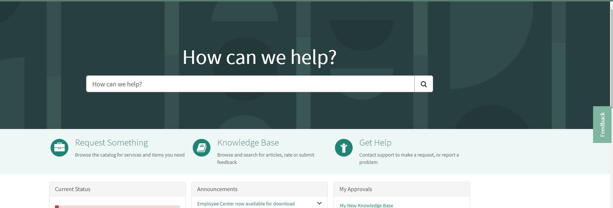

## Floater Feedback Widget

The attached widget can be used to have a floating link widget on the portal homepage when clicks opens a specific catalog item or a record producer. 
This can be used to gather feedback using a catalog item or create incidents from the portal.

Simply add this widget to the portal homepage anywhere and you can find this present on the side of the homepage. 

*Note: You need to update the sys_id of your catalog item in the widget.*
