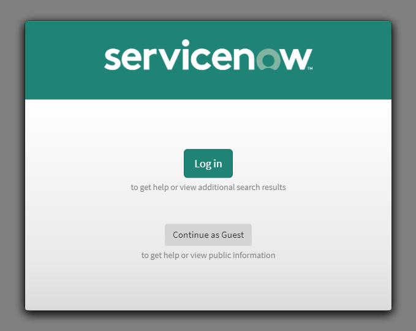

# Guest Login Modal Widget

This widget provides a modal dialog prompting guest users to either login or continue browsing as a guest.  This is intended to be used on public facing Service Portal pages, and as such the widget should also be made public.

## Example of Widget

## How it Works

The widget works by checking if a user is logged in or not when accessing the page it is placed on.  If the user is not logged in, the modal will prompt the user to either login or continue as a guest.

When the user clicks **Continue as Guest**, a browser session storage token is created to track that the guest has agreed to stay a guest, so they will not be prompted again during the session.

## Configurable Instance Options

While there is certainly room to expand upon instance configuration options, the following are already setup for this widget:

1. Header Image - set to any image name (from db_images)
2. Login Button Text
3. Login Help Text
4. Guest Button Text
5. Guest Help Text

## Setup the widget

> The entire widget and a demo page has been provided in an update set, `Service Portal - Guest Login Modal Widget.xml`, but the follow the steps below to set up the widget from scratch

1. Create a new widget and set **Public** to **True (checked)**
2. Copy the contents of `server.js` to the **Server script** window
3. Copy the contents of `client.js` to the **Client controller** window
4. Copy the contents of `optionSchema.json` to the **Option schema** window
5. Create a new **Angular ng-template** for the widget with **ID** set to `guest-login-content`, and then copy the contents of `ng-template.html` to the **Template** window.
6. Drag the newly created widget onto a **Public** Service Portal page.