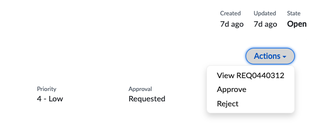
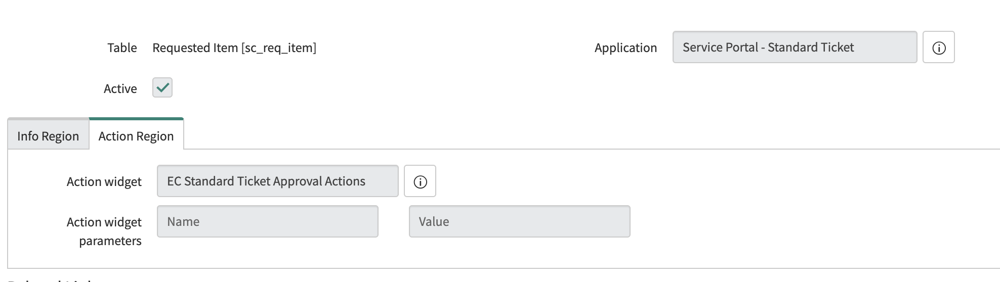

# Enhanced Action Widget for Standard Ticket Page

Adds additional action if current record has an approval pending or if current record is a Request Item, you can navigate to the Request level.
# Action Widget dropdown 

## How to use
Import the widget XML to your Service Portal Widget Table.
Go to Standard Ticket Configuration and select the table (record type) you'd like to add this widget too.
Then click on the Action Region tab, in the Action Widget field, add your new widget - EC Standard Ticket Approval Actions.

