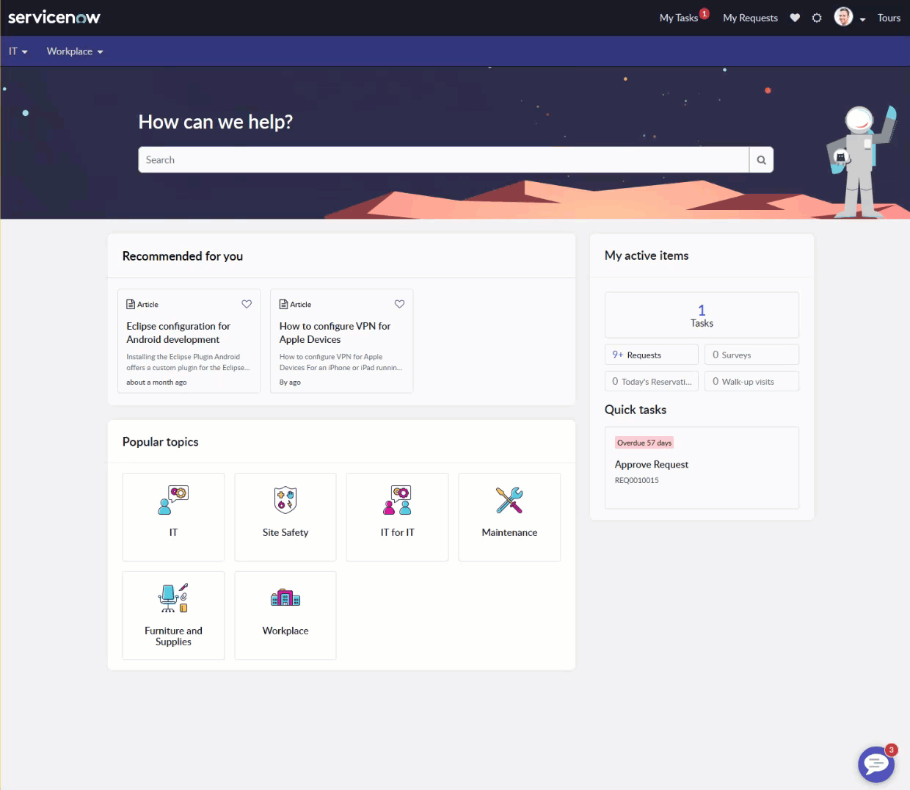

# Dark mode switcher ☀️/🌑

This is a simple demonstration of achieving a dark mode switcher for Employee Center portal. The switcher itself allows user to quickly toggle between multiple color modes:

* OS Default - uses the color scheme based on OS settings
* Dark - uses the dark color scheme ignoring OS settings
* Light - uses the light color scheme ignoring OS setting

This implementation doesn't need to clone any widget 🤯 and was originally build for Tokyo release 🗼 of Employee Center portal. Before trying to use it in your environment consider the following 👇:
* it was built just for fun 🎉 and as a personal challenge
* not all colors have been adjusted for dark mode, I even barely tested the homepage 🦄
* it might break in any upcoming releases 🐛
* finding the right color balance with good contrast ratio for all pages might require some additional effort and patience 
* consider how all of your images will look on both color schemes (you might even end with providing 2 color variants)
* let's hope that the nextgen portal will have this built-in OOTB 🤞

## Implementations Details

### user preference
For storing the user's preference of color scheme I created a user preference with the name `preferred_color_scheme`. I suggest to create a global one with the value `os-default`.

### Angular Providers
The following angular providers need to be created and attached to the `Employee Center Header` widget. You can create those via `m2m_sp_ng_pro_sp_widget` table.

[themeSwitcherMenu](themeSwitcherMenu.js) - a directive that will allow user to change color scheme

[avatarDropDown](avatarDropDown.js) - a "hacky" directive that will inject our theme switcher into the portal header next to the avatar profile menu

### Portal Theme

[EC Theme](portal_theme.scss) - just put this into your portal theme

### CSS Include

[EC Dark Mode](dark_mode.scss) - put this into your theme as a CSS Include

