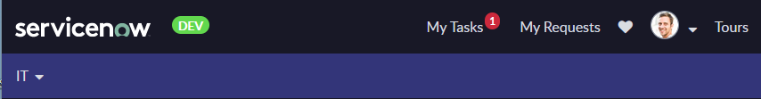

# Simple badge for portal header to visually distinguish subprod instances

This is a simple directive, that can be attached to the OOTB widget header and will render a simple badge based on the url hostname. 
This doesn't require any cloning of the OOTB widget. The only requirement is that the portal is using some logo.



## installation
1. create a new provider (select Service Portal->Angular Providers->New
2. select type directive
3. use the name `navbarBrandLogo` - this is important since it assumes usage of navbar-brand-logo class within the markup
4. paste the following code
```javascript
/*directive that will inject a badge next to the portal logo based on the instance url */
function navbarBrandLogo() {
  return {
    restrict: "C",
    link: function (scope, element) {
      //make sure we are applying this link function only within the header/footer
      if (scope.widget && scope.widget.sys_class_name !== "sp_header_footer") {
        return;
      }
      //TODO: adjust to your instance naming
      var matchedHostName = /yourcompanyname(.*).service-now.com/.exec(location.hostname);
      var instanceSuffix = matchedHostName ? matchedHostName[1] : "";
      var BADGE_COLORS = { dev: "#BADA55", qa: "lollipop" };
      if (instanceSuffix) {
        element.addClass("flex-row items-center");
        element.append(
          '<div class="badge m-l" style="background-color: ' +
            BADGE_COLORS[instanceSuffix] +
            '">' +
            instanceSuffix.toUpperCase() +
            "</div>"
        );
      }
    },
  };
}

```
5. attach the created provider to the header widget
