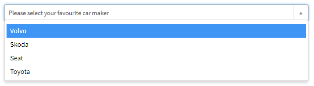
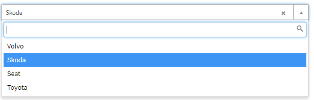

# sn-choice-list
`sn-choice-list` is an existing and really useful directive that can help you quickly create a simple choice list.

The following table lists all of the scope bindings that can be passed to the directive

| Property      | Description                                                                                                     |
|---------------|-----------------------------------------------------------------------------------------------------------------|
| snModel         | simple javascript variable that will store selected value. You can set default of the sn-choice-list by setting this variable |
| snTextField         | ****required****, set which key from the object in snItems to be used as a display value                                                                         |
| snValueField  | ****required****, set which key from the object in snItems to be used as a value                                                                       |
| snOptions    | object with 3 configurations. <br />- *placeholder* will set a text to appear when there is no value set <br />- *allowClear* (true/false) will show or hide "x" button to allow user to clear the value by pressing it <br />- *hideSearch* (true/false) will show or hide search bar to allow user search for the choices             |
| snItems  | ****required****, array of objects, that will represent our choices. It should contain a value and a label, value is hidden and is used to track which option the user chose. Label is visible. We need to specify what is the name/key of our "value" and "label" so directive knows which values to use. We can specify it by using snTextField and snValueField attribute                                           |
| snOnChange    | It is a callback when user choses a value. We can call a function that can do additional logic after a user choses a value                                             |
| snDisabled  | (true/false) value that can disable the choicelist (prevent users from interacting with it)                                                          |
| snDialogName  | if we are using this directive in a dialog and we specify a name attribute of the dialog class. We can add this name as an option and when the dialog will fire a close event sn-choice-list link function will destroy this element


## Usage example

### Simple choice list


**HTML**
```html
  <sn-choice-list sn-model="c.choice" sn-value-field="value" sn-text-field="label" sn-items="c.items"></sn-choice-list>
```
**Client controller**
```javascript
c.choice = '';

c.items = [{
	value: 'volvo',
	label: 'Volvo'
	},{
	value: 'skoda',
	label: 'Skoda'
	},{
	value: 'seat',
	label: 'Seat'
	},{
	value: 'toyota',
	label: 'Toyota'
}];
```

### Setting options and callback


**HTML**
```html
 <sn-choice-list sn-model="c.field" 
                  sn-value-field="value" 
                  sn-text-field="label"
                  sn-items="c.items"
                  sn-options="c.choiceListOptions"
                  sn-on-change="c.logValue()"></sn-choice-list>
```
**Client controller**
```javascript
c.field = {
    value: '',
    displayValue: ''
};
```

### Multiple selection


**HTML**
```html
<sn-record-picker table="'sys_user'" display-field="'name'" multiple="true" field="c.field"></sn-record-picker>

```
**Client controller**
```javascript
/* widget controller */
var c = this;

// Configuration file to set default options
c.choiceListOptions = {
	placeholder: 'Please select your favourite car maker',
	allowClear: true,
	hideSearch: false
};

// List of our available Choices
c.items = [{
	value: 'volvo',
	label: 'Volvo'
	},{
	value: 'skoda',
	label: 'Skoda'
	},{
	value: 'seat',
	label: 'Seat'
	},{
	value: 'toyota',
	label: 'Toyota'
}];

// Setting Default Value
c.field = 'skoda';

c.logValue = function() {
	console.log(c.field);
}
```