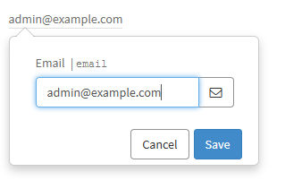

# sp-editable-field
`sp-editable-field` directive allows to render an interactive field label which allows user to directly modify the value by showing a miniform with just one field.

The following table lists all of the scope bindings that can be passed to the directive

| Property              | Description                                                        |
|-----------------------|--------------------------------------------------------------------|
| fieldModel            | fieldModel object that can be obtained via $sp.getForm API         |
| table                 | table name                                                         |
| tableId               | record sys_id                                                      |
| block                 | display as a block level element                                   |
| editableByUser        | if true allows user to edit the field value                        |
| onChange              | function to execute when onChange event occurs within the form     |
| onSubmit              | function to execute when onSubmit event is triggered from the form |
| asyncSubmitValidation |                                                                    |


## Usage example


### Editable user's email address


**HTML temlate**
```html
<sp-editable-field table="sys_user" table-id="data.userSysId" editable-by-user="true" field-model="data.sysUserModel.email"></sp-editable-field>
```

**Server Script**
```javascript
(function() {  
	var sysUserForm = $sp.getForm('sys_user', gs.getUserID());
	data.userSysId = gs.getUserID();
	data.sysUserModel = sysUserForm._fields;	
})();
```