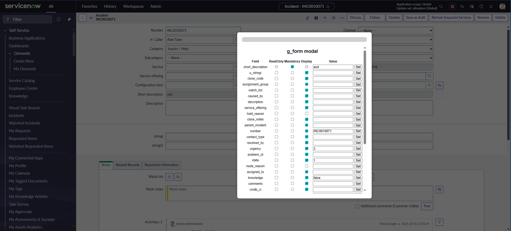

# g_form Bookmarklet Modal

This script provides a bookmarklet that injects a draggable modal into ServiceNow forms that allows the user to interact with fields on forms. Tested on next exp classic forms with or without top navigation, workspace(needs snutils installed) and portal.
---

## 📸 Screenshots

### Modal Overview

---

## 🔧 How to Use

1. **Copy the minified script** on the first line of the *Open modal to use g_form.js* file
2. **Create a bookmark** in your browser.
3. Paste the script into the bookmark's URL field.
4. Navigate to a ServiceNow form and click the bookmarklet.
