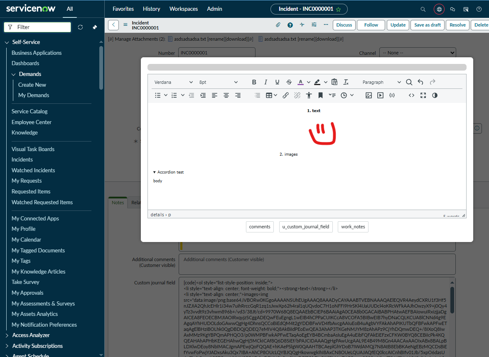

# tinymce journal editor Bookmarklet Modal

This script is a bookmarklet that injects a draggable modal into a form (or ui page with access to ScriptLoader api in the content frame) with a tiny mce editor and buttons to insert the html to the journal fields on the form.

The dependency for tinymce is loaded from the instance itself and a html field does not need to be present on the form. 

---

## 📸 Screenshots

### Modal Overview

---

## 🔧 How to Use

1. **Copy the minified script** on the first line of the *Open tinymce editor in modal for journal fields.js* file
2. **Create a bookmark** in your browser.
3. Paste the script into the bookmark's URL field.
4. Navigate to a ServiceNow form and click the bookmarklet.
5. Input formatted text into editor and click a button from the bottom to set the html to the corresponding journal field with the [code] tags
