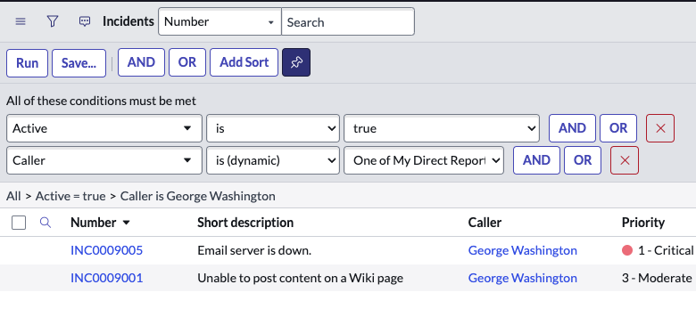
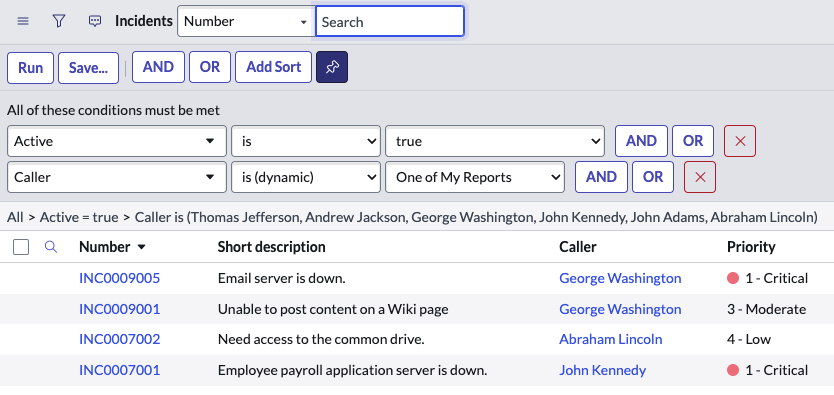
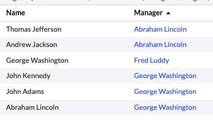

# Summary #
This looping script traverses the User table from a certain point to get either one level of employees or all employees in the hierarchy underneath the logged-on user. There are two functions:
1. **One of My Direct Reports**: gets only users directly reporting to the logged on user
1. **One of My Reports**: gets all users reporting to the logged on user

> [!WARNING]
> There is some recursion protection, but the use of this script could have performance impacts for very large organizations. Use at your discretion.

**How to Use**
* Admins can use the script as a Reference Qualifier
* Users (with platform access) can select the predefined filter in lists and reports (like with "One of My Assignments").

# Solution #
This solution has three main components:
* 1 Client Callable Script Include
* 2 Dynamic Filters

> [!NOTE]
> You will also need to create an ACL for your client callable script include.  Think through other security rules before using this filter broadly for users without roles. OOTB Users without roles are often restricted to seeing only their items, for example, a User without itil or snc_incident_read typically cannot see other user's Incidents unless they are the Opened by or are on the Watch list. Make sure you test as the users you hope to publish this item to.

## Script Include (sys_script_include) ##

| Field | Value |
|---|---|
| Name | getMyReportsUtil |
| Client Callable | true |
| Script | <em>see [getMyReportsUtil.js](getMyReportsUtil.js)</em> |

## Dynamic Filter Option (sys_filter_option_dynamic) ##

### One of My Direct Reports ###

| Field | Value |
|---|---|
| Label | One of My Direct Reports |
| Script | new global.getMyReportsUtil().getMyDirectReports() |
| Field type | Reference |
| Reference Table | User [sys_user] |
| Order | 500 |
| Roles | Choose the same role(s) you added to the Script Include ACL |
| Reference script | Script Include: getMyReportsUtil |
| Available for filter | true |
| Available for ref qual | true |

**Example Incident list filtered by Caller is One of My Direct Reports**

### One of My Reports ###

| Field | Value |
|---|---|
| Label | One of My Reports |
| Script | new global.getMyReportsUtil().getMyReports() |
| Field type | Reference |
| Reference Table | User [sys_user] |
| Order | 600 |
| Roles | Choose the same role(s) you added to the Script Include ACL |
| Reference script | Script Include: getMyReportsUtil |
| Available for filter | true |
| Available for ref qual | true |

**Example Incident list filtered by Caller is One of My Reports**

 ### Example Manager Data for the screenshots above ###

