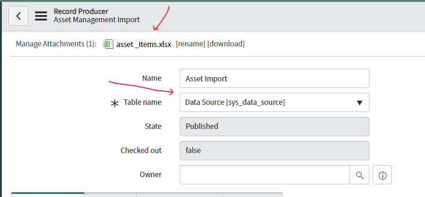
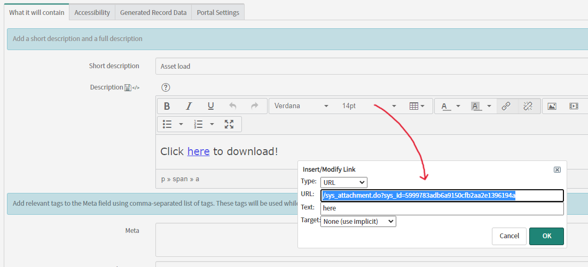
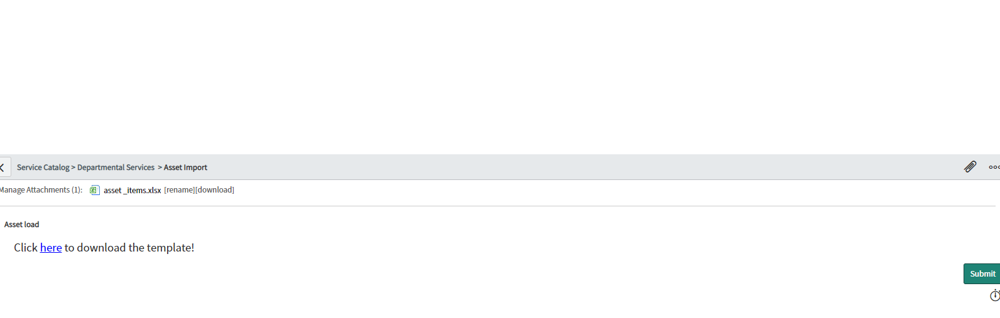

# Create Records importing an excel spreadsheet in the record producer.
The script import the excel spreadsheet in the Data Source table (sys_data_source) and trigger the tranform map to create records.

## Configuration
Step 1. Create a Transform Map
1. Navigate to **System Import Sets > Transform Maps**
2. Create a new transform map for your target table
3. Map Excel columns to ServiceNow fields

Step 2. Configure Record Producer Fields
Add the following fields to your Record Producer:
- **Table name field** mapped to "Data Source"
- **Excel template file table name field** 
- **Attachment field** for file upload

Step 3. Add User Instructions and Download link for Template
1. Insert a description with a download link for users to get the Excel template
2. Include clear instructions for filling out the template
3. Specify any required format or validation rules

Step 4. Insert the script and change the static fields
1. Insert the server script into your Record Producer
2. Update any static fields to match your specific use case
3. Test the script functionality

Step 5. The users need to drop attach the file and submit the record producer

1. Attach their completed Excel file
2. Submit the Record Producer form in the service catalog
3. The system automatically processes the file and creates records

Troubleshooting
Import fails: Check the System Logs for errors. Verify Excel format and Transform Map mappings.
No records created: Ensure the Data Source record is populated correctly and the Transform Map runs without coalescing issues.
