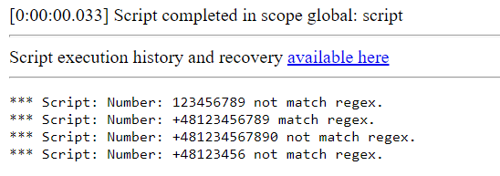

**Regular Expressions**

 Regular Expressions, which allows checking for Poland nine-digit Country code. Poland format starts with +48 and is followed by nine digits.

**Example effect of execution**

