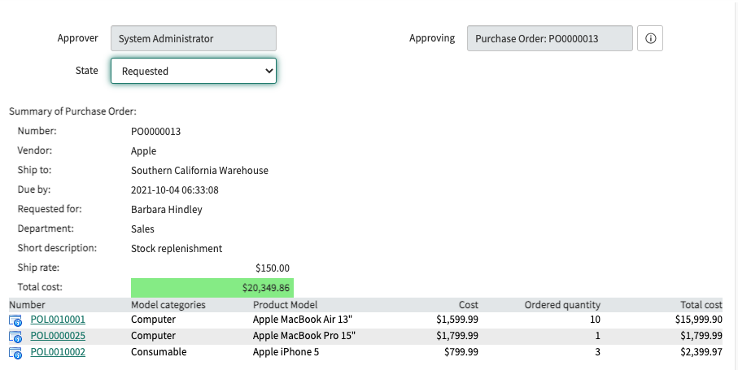

With the [Procurement plugin](https://docs.servicenow.com/bundle/rome-it-asset-management/page/product/procurement/concept/c_Procurement.html), Asset managers can track vendor purchase orders for hardware and software assets. This application does not have approvals built-in by default, but that is a common addition.

When these approvers are also fulfillers, they will likely be approving from the platform rather than via the portal. The included XML is to be used in a UI Macro to show critical Purchase Order data elements so that the approver can approve directly from the approval record without clicking into the PO.

Here is an example:

